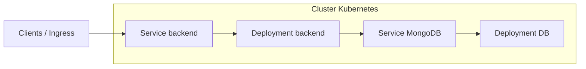

# TaskFlow · Kubernetes

Application de gestion de tâches (**TaskFlow**) : API **Node.js** (**Express** + **MongoDB** via **Mongoose**), conteneurisée avec **Docker** et déployable sur **Kubernetes**. Ce dépôt regroupe le code backend, les manifestes K8s et le pipeline **GitHub Actions**.

---

## Sommaire

- [Vue d’ensemble](#vue-densemble)
- [Stack technique](#stack-technique)
- [Structure complète du dépôt](#structure-complète-du-dépôt)
- [Rôle de chaque dossier](#rôle-de-chaque-dossier)
- [Architecture Kubernetes (aperçu)](#architecture-kubernetes-aperçu)
- [Démarrage rapide](#démarrage-rapide)

---

## Vue d’ensemble

| Couche | Rôle |
|--------|------|
| **Backend** | API REST pour les tâches (routes → contrôleurs → services → MongoDB). |
| **Conteneur** | Image Docker basée sur Node 22 Alpine, port **3000**, variable `MONGO_URI` par défaut dans le `Dockerfile`. |
| **Orchestration** | Déploiements et services Kubernetes pour l’API et la base MongoDB. |
| **CI/CD** | Workflow GitHub Actions (`.github/workflows/ci-cd.yml`) pour automatiser build / tests / déploiement selon votre configuration. |

---

## Stack technique

- **Runtime** : Node.js (ES modules, `type: "module"` dans `package.json`)
- **Framework** : Express 5
- **Base de données** : MongoDB (connexion Mongoose)
- **Config locale** : `dotenv` — fichier `backend/.env` (ex. `DB_URL=...`)

---

## Structure complète du dépôt

```
taskFlow-k8s/
│
├── .github/
│   └── workflows/
│       └── ci-cd.yml                 # Pipeline CI/CD (GitHub Actions)
│
├── backend/                          # Application API
│   ├── Dockerfile                    # Image Node 22 Alpine, WORKDIR /backend, EXPOSE 3000
│   ├── package.json                  # Scripts npm, dépendances (express, mongoose, dotenv)
│   ├── package-lock.json
│   ├── .env                          # Variables d’environnement locales (ne pas committer les secrets)
│   ├── servcer.js                    # Point d’entrée prévu (voir note ci-dessous)
│   └── src/
│       ├── controller/
│       │   └── task.controller.js    # Handlers HTTP liés aux tâches
│       ├── service/
│       │   └── task.service.js       # Logique métier / accès données
│       ├── routes/
│       │   └── task.route.js         # Définition des routes Express
│       └── exeception/
│           └── custumException.js    # Exceptions / erreurs personnalisées
│
└── k8s/                              # Manifestes Kubernetes
    ├── backend/
    │   ├── backend-deployment.yaml       # Déploiement du pod backend
    │   ├── backend-config-deployment.yaml  # ConfigMap / secrets ou config liée au backend
    │   └── service-deployment.yaml         # Service (exposition réseau du backend)
    └── db/
        ├── db-deployment.yaml            # Déploiement MongoDB (StatefulSet ou Deployment selon contenu)
        └── db-service-deplyment.yaml     # Service réseau vers la base (nom de fichier avec typo « deplyment »)
```

> **Note** : le script `npm start` dans `package.json` exécute `node server.js`, alors que le fichier présent s’appelle `servcer.js`. Renommez le fichier en `server.js` (ou alignez le champ `main` / `scripts.start`) pour que le démarrage fonctionne.

---

## Rôle de chaque dossier

### `.github/workflows/`

Fichiers YAML exécutés par **GitHub Actions** à chaque push ou selon les déclencheurs que vous définirez (build Docker, tests, déploiement vers un cluster, etc.).

### `backend/`

| Élément | Description |
|---------|-------------|
| `Dockerfile` | Construit l’image : copie `package.json`, `npm install`, copie du code, `CMD ["npm", "start"]`. |
| `src/routes/` | Montage des routes Express (`/api/...` selon votre choix). |
| `src/controller/` | Réception des requêtes, codes HTTP, appel aux services. |
| `src/service/` | Règles métier et interaction avec Mongoose / MongoDB. |
| `src/exeception/` | Gestion d’erreurs centralisée (nom du dossier : variante de « exception »). |

### `k8s/backend/`

Ressources pour faire tourner l’API dans le cluster : **Deployment** (réplicas, image, variables), **Service** (ClusterIP / LoadBalancer / NodePort selon ce que vous y mettez), et éventuellement **ConfigMap** dans `backend-config-deployment.yaml`.

### `k8s/db/`

Ressources pour **MongoDB** : déploiement du conteneur base de données et **Service** pour que les pods backend se connectent via un nom DNS stable (ex. `mongodb://service-name:27017/...`).

---

## Architecture Kubernetes (aperçu)

Flux logique une fois les manifestes remplis et appliqués :



---

## Démarrage rapide

### Backend en local

```bash
cd backend
npm install
# Configurer backend/.env (ex. DB_URL=mongodb://localhost:27017/taskFlow)
npm start
```

Assurez-vous qu’un **MongoDB** tourne localement ou mettez une URI accessible.

### Image Docker

```bash
cd backend
docker build -t taskflow-backend:latest .
docker run -p 3000:3000 -e MONGO_URI="mongodb://host.docker.internal:27017/taskFlow" taskflow-backend:latest
```

*(Adaptez `MONGO_URI` selon votre réseau Docker / hôte.)*

### Kubernetes

```bash
kubectl apply -f k8s/db/
kubectl apply -f k8s/backend/
```

Vérifiez les noms de namespace, les labels et les images dans chaque fichier YAML avant d’appliquer en production.

---

## Licence

Voir le champ `license` dans `backend/package.json` (ISC par défaut) ou remplacez-le par la licence de votre choix.
